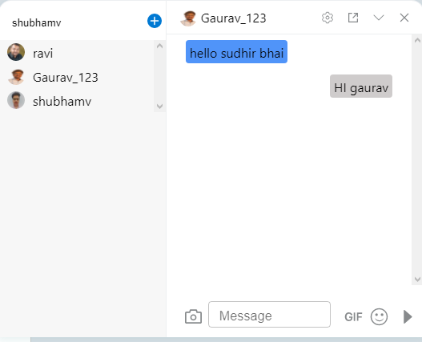
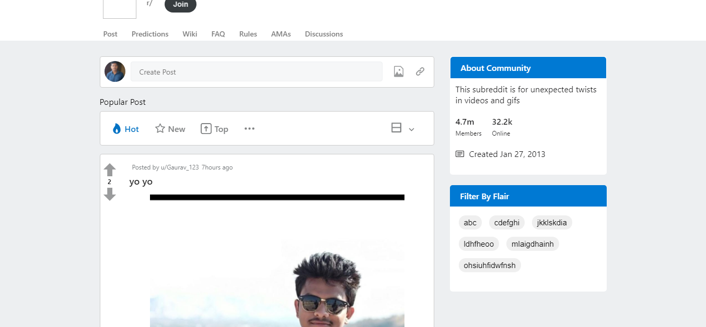
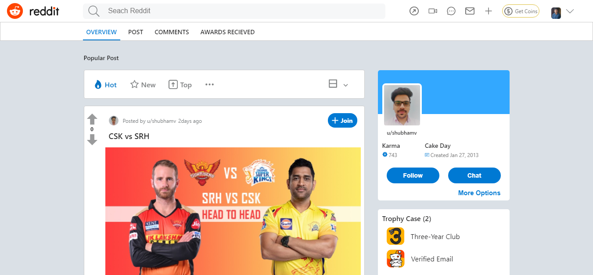

# Reddit - Website Clone - Project Work

reddit.com : Reddit is an American social media platform. It is the home to thousands of communities, endless conversation, and authentic human connection.


**Our team was given a task to clone the reddit.com Website.**

### Landing Page :

The landing page of reddit website displays various breaking news, sports, TV fan theories, or a never-ending stream of the internet's cutest animals, there's a community on Reddit for you.

In top section there is a Navbar which displays varius sections of website e.g. chat application , switching dark-light theme etc.
posts and comments related to post are included in the page.
At right side section there is a sidebar, both Header & Footer are same across all the pages.
<br/>

<br/>

### Login Page:

Existing user can Login and new user's can SignUp themselves on page.
From NavigationBar of Landing Page.


After Login user direcly redirect to home page.

There are some Key Features which are added in website clone such as:

### Special features:

- _Chat Application_
- _Dark & Light Theme_
- _Communities and Users_
- _Easy navigation by links_

<p>




</p>

## Team Members and Contributors

- [@Ravi Shukla](https://github.com/ravishukla86044/)
- [@Shubham](https://github.com/vshubhams)
- [@Gaurav Parmar](https://github.com/Gaurav6291)
- [@Sudhir Kumar Samantaray](https://github.com/devSudhir)

## NPM Packages used
- ### react-router-dom [](https://github.com/ReactTraining/react-router/tree/master/packages/react-router-dom)
- ### axios [](https://github.com/axios/axios)

- ### create-react-app [](https://github.com/facebook/create-react-app)
- ### styled-components [](https://github.com/styled-components/styled-components)
- ### Redux [](https://www.npmjs.com/package/redux)

- ### react-icons [](https://www.npmjs.com/package/react-icons)

- ### socket.io-client [](https://www.npmjs.com/package/socket.io-client)

- ### MongoDB [![MongoDB]](https://github.com/mongodb/mongo)
- ### Node.js [![Node.js]](https://github.com/nodejs/node)

## Technologies Used

<p float="left">
  
   
  
  
  
  
  
</p>

## Installing and Running

Executing the commands mentioned below one by one in your command line will help in making this React app .
**Cloning**

```
git clone https://github.com/ravishukla86044/reddit

```

**To run the react app execute below command**

```
cd ./reddit
npm install
npm run start

```
